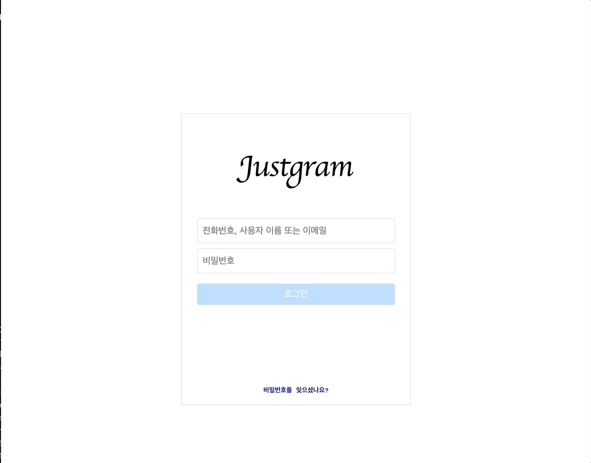
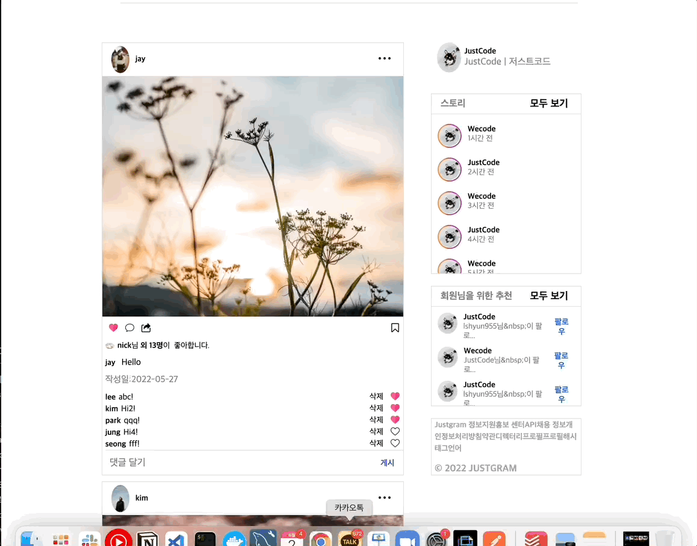

# Justgram...

---

> React로 만든 인스타그램 클론 코딩 프로젝트

## 🖥 프로젝트

**Login Page**

**Main Page**

- **주제**: React를 사용한 Instagram clone

  - CRA를 사용한 초기 세팅
  - 5명의 팀원들이 공동 component, scss 사용 및 관리
  - git을 사용한 첫 번째 협업

- 📅 **프로젝트 기간**

  ​ 2022.05.23 - 2022.06.02

## 👨‍💻 팀 원 별 작업 현황

- **공통**

  - 로그인 페이지 레이아웃
  - id, pw 입력 시 로그인 버튼 활성화 기능
  - 메인 페이지 레이아웃
  - 댓글 내용 입력 후 Enter press, 혹은 게시 버튼 클릭 시 댓글 추가 기능
  - 문자 입력 시 게시 버튼 활성화 기능

- **김지은**

- **김예찬**

- **이수현**
  - 피드별 댓글 삭제 및 좋아요 기능
  - 피드별 좋아요 기능
- **정진우**

- **케빈**

## 🔧 기술 스택

- HTML,CSS
- JavaScript(ES6+)
- React
- SCSS

## ✏️ 작업 순서 (git)

1. 초기 세팅된 git repository clone하기

`git clone https://github.com/wecode-bootcamp-korea/justcode-5-just-gram-react-team-3`

2. main branch에서 자신만의 브랜치 만들고 checkout하기

`git branch feature/자기 이름`

`git checkout feature/자기 이름`

3. <i><b>자기 브랜치에서만 작업하기</b></i>

4. 작업 완료 후에 바로 add commit push를 하는 게 아니라 github을 확인한 후 main 브랜치가 update되었는지 확인하기(update가 되었다면 5번부터 읽기, 안되었다면 8번부터 읽기)

5. 만약 main 브랜치가 update되었다면(혹시나 혹시나 common.scss가 update되었다면?!) main 브랜치로 checkout하기

`git checkout main`

6. update된 코드 다운로드 받기

`git pull origin main`

7. feature/자기이름 브랜치로 다시 이동해서 master branch merge하기

`git checkout feature/자기 이름`

`git merge main`

8. 자기 코드에 이상이 없는지 확인 후에 add, commit, push 하기

`git add .`

`git commit -m "[자기 이름] ADD : 적용된 내용"`

`git push origin feature/자기 이름`

9. github에서 PR(Pull Request) 보내기

10. 다시 3번부터 무한 반복...

## 📕 팀원별 기술 블로그

- 김예찬 : [김예찬님 블로그]()
- 김지은: [김지은님 블로그]()
- 정진우: [정진우님 블로그](https://velog.io/@happyeveryone96)
- 이수현: [이수현님 블로그](https://velog.io/@lshyun955)
- 케빈: [케빈님 블로그]()
